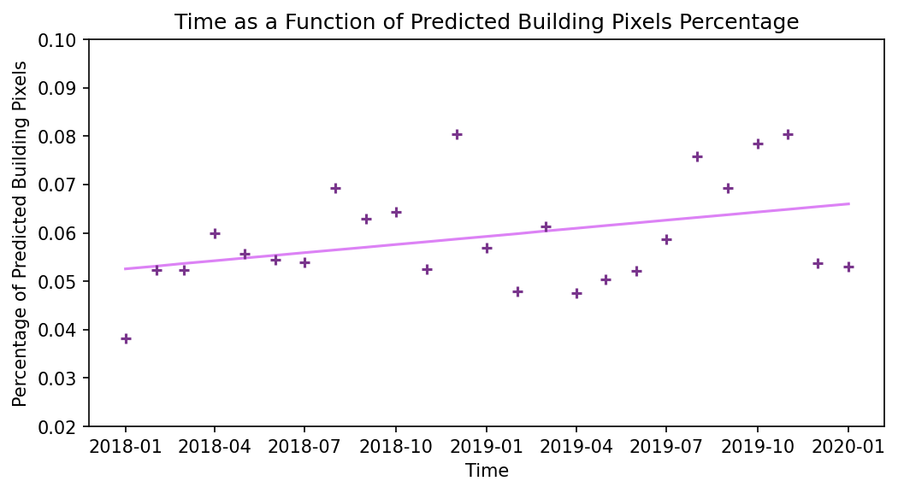

# Final Report

**Author**: Zhenzhao Xu zhenzhao@upenn.edu, Xiong Zheng zhxiong@upenn.edu 

# Introduction

In this project, we tried to use convolutional neural network to train a model that detects the outlines and areas of buildings. After training, we applied the model to developing cities in the test dataset to understand the trends (heated areas) of urban development. The use case of this model is to advice real estate investments.

# Data

| Data                      | Source                             | Description                                                                                                                                                                                                                                                                                                                |
| ------------------------- | ---------------------------------- | -------------------------------------------------------------------------------------------------------------------------------------------------------------------------------------------------------------------------------------------------------------------------------------------------------------------------- |
| SpaceNet Satellite Images | https://spacenet.ai/sn7-challenge/ | This dataset consists of Planet satellite imagery mosaics, which includes 24 images (one image per month) covering ~100 unique geographies. The dataset comprises over 40,000 square kilometers of satellite images and exhaustive polygon labels of building footprints, totaling over 10 million individual annotations. |

Imagery consists of RBGA (red, green, blue, alpha) 8-bit electro-optical (EO) monthly mosaics from Planet’s Dove constellation at 4 meter resolution. For each of the Areas Of Interest (AOIs), the data cube extends for roughly two years, though it varies somewhat between AOIs. All images in a data cube are the same shape, though some data cubes have shape 1024 x 1024 pixels, while others have a shape of 1024 x 1023 pixels. Each image accordingly has an extent of roughly 18 square kilometers.

<center><a href="https://www.kaggle.com/datasets/amerii/spacenet-7-multitemporal-urban-development">Spacenet 7 Multi-Temporal Urban Development | Kaggle</a><br>The SpaceNet has already labeled the outlined footprint of each building.</center>


​    There are 1408 regions in the data. Within each region, there are a high-resolution images (1024*1024 RGB) and a GeoJson file with geometry attributes of buildings. Some images have the shape of 1023 * 1023 instead of 1024 * 1024. So to format the data, we enlarge all images into 1024 * 1024 pixels by filling black pixels to the right and bottom edges of those images. We don't have to do the same change to GeoJson, with its coordinates starting at the upper left point of the image. So it fits well with those modified satellite images.

```python
def imagePathToArray(path):
  # read satellite img as numpy array
  image = Image.open(path)
  image = np.array(image)[:,:,:3]
  # fill black pixels to the right and bottom edges of 1023*1023 images
  zeros = np.zeros((1024,1024,3), dtype=np.uint8)
  zeros[:image.shape[0],:image.shape[1],:] = image
  return zeros
```

​    And to make the training process efficient, we split each `Satellite Image` and `Building Masks` (1024 * 1024) to 16 images (256 * 256).

```python
def splitArray(arr, splitNum=4):
  # split the image into smaller chunks
  return [np.hsplit(x, splitNum) for x in np.vsplit(arr,splitNum)]
```

# Methods

Based on the use case, we choose U-Net as the model for image segmentation, the concept is shown as follows:


*Reference: [U-Net: Convolutional Networks for Biomedical Image Segmentation](https://arxiv.org/pdf/1505.04597.pdf)*


### Structure

| Layer | Name                   | Type               | Shape                 |
| -----:|:---------------------- |:------------------ |:--------------------- |
| 0     | input_1                | InputLayer         | [(None, 256, 256, 3)] |
| 1     | conv2d                 | Conv2D             | (None, 128, 128, 32)  |
| 2     | batch_normalization    | BatchNormalization | (None, 128, 128, 32)  |
| 3     | activation             | Activation         | (None, 128, 128, 32)  |
| 4     | activation_1           | Activation         | (None, 128, 128, 32)  |
| 5     | separable_conv2d       | SeparableConv2D    | (None, 128, 128, 64)  |
| 6     | batch_normalization_1  | BatchNormalization | (None, 128, 128, 64)  |
| 7     | activation_2           | Activation         | (None, 128, 128, 64)  |
| 8     | separable_conv2d_1     | SeparableConv2D    | (None, 128, 128, 64)  |
| 9     | batch_normalization_2  | BatchNormalization | (None, 128, 128, 64)  |
| 10    | max_pooling2d          | MaxPooling2D       | (None, 64, 64, 64)    |
| 11    | conv2d_1               | Conv2D             | (None, 64, 64, 64)    |
| 12    | add                    | Add                | (None, 64, 64, 64)    |
| 13    | activation_3           | Activation         | (None, 64, 64, 64)    |
| 14    | separable_conv2d_2     | SeparableConv2D    | (None, 64, 64, 128)   |
| 15    | batch_normalization_3  | BatchNormalization | (None, 64, 64, 128)   |
| 16    | activation_4           | Activation         | (None, 64, 64, 128)   |
| 17    | separable_conv2d_3     | SeparableConv2D    | (None, 64, 64, 128)   |
| 18    | batch_normalization_4  | BatchNormalization | (None, 64, 64, 128)   |
| 19    | max_pooling2d_1        | MaxPooling2D       | (None, 32, 32, 128)   |
| 20    | conv2d_2               | Conv2D             | (None, 32, 32, 128)   |
| 21    | add_1                  | Add                | (None, 32, 32, 128)   |
| 22    | activation_5           | Activation         | (None, 32, 32, 128)   |
| 23    | separable_conv2d_4     | SeparableConv2D    | (None, 32, 32, 256)   |
| 24    | batch_normalization_5  | BatchNormalization | (None, 32, 32, 256)   |
| 25    | activation_6           | Activation         | (None, 32, 32, 256)   |
| 26    | separable_conv2d_5     | SeparableConv2D    | (None, 32, 32, 256)   |
| 27    | batch_normalization_6  | BatchNormalization | (None, 32, 32, 256)   |
| 28    | max_pooling2d_2        | MaxPooling2D       | (None, 16, 16, 256)   |
| 29    | conv2d_3               | Conv2D             | (None, 16, 16, 256)   |
| 30    | add_2                  | Add                | (None, 16, 16, 256)   |
| 31    | activation_7           | Activation         | (None, 16, 16, 256)   |
| 32    | conv2d_transpose       | Conv2DTranspose    | (None, 16, 16, 256)   |
| 33    | batch_normalization_7  | BatchNormalization | (None, 16, 16, 256)   |
| 34    | activation_8           | Activation         | (None, 16, 16, 256)   |
| 35    | conv2d_transpose_1     | Conv2DTranspose    | (None, 16, 16, 256)   |
| 36    | batch_normalization_8  | BatchNormalization | (None, 16, 16, 256)   |
| 37    | up_sampling2d_1        | UpSampling2D       | (None, 32, 32, 256)   |
| 38    | up_sampling2d          | UpSampling2D       | (None, 32, 32, 256)   |
| 39    | conv2d_4               | Conv2D             | (None, 32, 32, 256)   |
| 40    | add_3                  | Add                | (None, 32, 32, 256)   |
| 41    | activation_9           | Activation         | (None, 32, 32, 256)   |
| 42    | conv2d_transpose_2     | Conv2DTranspose    | (None, 32, 32, 128)   |
| 43    | batch_normalization_9  | BatchNormalization | (None, 32, 32, 128)   |
| 44    | activation_10          | Activation         | (None, 32, 32, 128)   |
| 45    | conv2d_transpose_3     | Conv2DTranspose    | (None, 32, 32, 128)   |
| 46    | batch_normalization_10 | BatchNormalization | (None, 32, 32, 128)   |
| 47    | up_sampling2d_3        | UpSampling2D       | (None, 64, 64, 256)   |
| 48    | up_sampling2d_2        | UpSampling2D       | (None, 64, 64, 128)   |
| 49    | conv2d_5               | Conv2D             | (None, 64, 64, 128)   |
| 50    | add_4                  | Add                | (None, 64, 64, 128)   |
| 51    | activation_11          | Activation         | (None, 64, 64, 128)   |
| 52    | conv2d_transpose_4     | Conv2DTranspose    | (None, 64, 64, 64)    |
| 53    | batch_normalization_11 | BatchNormalization | (None, 64, 64, 64)    |
| 54    | activation_12          | Activation         | (None, 64, 64, 64)    |
| 55    | conv2d_transpose_5     | Conv2DTranspose    | (None, 64, 64, 64)    |
| 56    | batch_normalization_12 | BatchNormalization | (None, 64, 64, 64)    |
| 57    | up_sampling2d_5        | UpSampling2D       | (None, 128, 128, 128) |
| 58    | up_sampling2d_4        | UpSampling2D       | (None, 128, 128, 64)  |
| 59    | conv2d_6               | Conv2D             | (None, 128, 128, 64)  |
| 60    | add_5                  | Add                | (None, 128, 128, 64)  |
| 61    | activation_13          | Activation         | (None, 128, 128, 64)  |
| 62    | conv2d_transpose_6     | Conv2DTranspose    | (None, 128, 128, 32)  |
| 63    | batch_normalization_13 | BatchNormalization | (None, 128, 128, 32)  |
| 64    | activation_14          | Activation         | (None, 128, 128, 32)  |
| 65    | conv2d_transpose_7     | Conv2DTranspose    | (None, 128, 128, 32)  |
| 66    | batch_normalization_14 | BatchNormalization | (None, 128, 128, 32)  |
| 67    | up_sampling2d_7        | UpSampling2D       | (None, 256, 256, 64)  |
| 68    | up_sampling2d_6        | UpSampling2D       | (None, 256, 256, 32)  |
| 69    | conv2d_7               | Conv2D             | (None, 256, 256, 32)  |
| 70    | add_6                  | Add                | (None, 256, 256, 32)  |
| 71    | conv2d_8               | Conv2D             | (None, 256, 256, 2)   |
|       | Total param: 2,058,690 |                    |                       |

The


# Results

​In this project, we try to use convolutional neural network to train the model and detect the outlines and areas of buildings. The use case of this model is to advice the real estate investment. With the UNet structure, our Method One has achieved convincing results of detecting building outlines. So we stick to the Method One and try to tune the parameter to achieve a better learning and predicting effect, instead of settle for using the alternative Method Two. The parameters we finally used in the model are listed as follows.

```python
epochs = 35
batch_size=10
optimizer="rmsprop"
loss="sparse_categorical_crossentropy"
```

The training process is shown as follows. SHOULD BE REPLACED. We can see from the plot that, as the number of epochs increases, the accuracy of the model steadily increases and the loss steadily decreases. However, because of the limitation of the computing power, we stopped at 35 epochs.


The final result is shown below. We can see that the model really does a great job, and its accuracy is beyond our expectations. The model not only distinguishs the building outlines clearly, but also tells the difference between rural land and urban area. **(What does this mean?)** The final accuracy on the testing dataset is 95.92%. 


*From left to right: x test, y test, prediction*

​After obtaining a satisfying model, we applied the model to our use case that is to detect the urban development trends in a developing country. Therefore, we selected 25 months of satellite images in Asunción, the capital city of Paraguay. The city experienced a fast development in the past decade. And we apply the model on these images to see the urban development from January 2018 to January 2021. The predictions of each year is shown below. One thing that needs to be noted is that the images below is actually the concatenation of 16 model outputs. (The resolution of each images is 1028\*1028, while the resolution of the input/output of the model is 256\*256).


The result shows that in the past 25 months, increased density, broadened built environment boundaries, and less green lands can be observed in Asunción. Additionally, the west side on the image is experiencing a tenser development.



# Discussion

Discuss the results of your approach.

Did your machine learning method perform as expected? Why or why not? 

From what we discuss above, we believe it is safe to say that the model really does a great job. The Unet structure works perfectly as expected. The downsampling and upsampling process enable the model successfully distinguish the buildings from other elements with a test accuracy of over 95.9%. 

The architecture...

Did you solve your original problem? 

How might your results be practically useful or applicable? 

Also make sure to discuss any other approaches you tried, and why they were not successful
