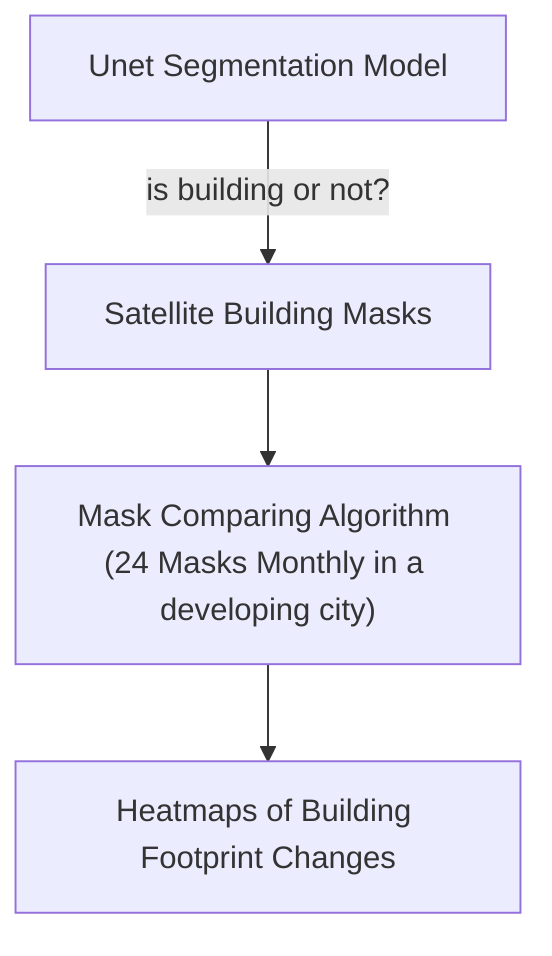
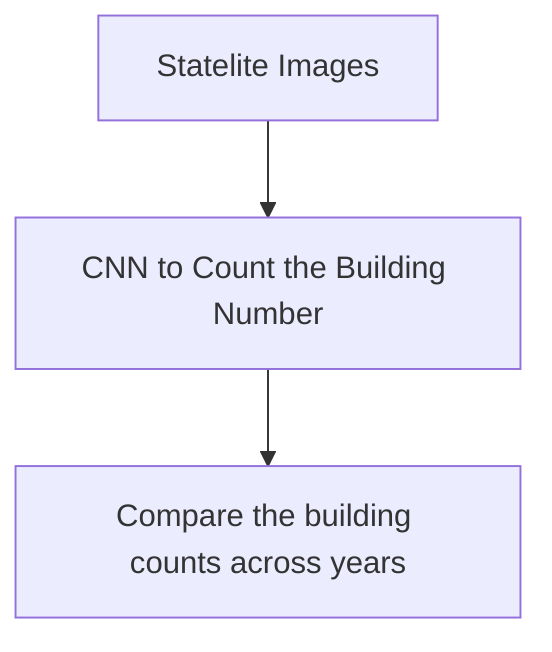

# Preliminary Report

- [Preliminary Report](#preliminary-report)
  - [Abstract](#abstract)
  - [Project Method](#project-method)
    - [Method 0](#method-0)
    - [Method 1](#method-1)
  - [Data sources](#data-sources)

## Abstract

In this project, we try to use convolutional neural network to train the model and detect the outlines and areas of buildings. After the training, we will apply the model to developing cities in the dataset to understand the trends (heated areas) of urban development. The use case of this model is to advice the real estate investment.

## Project Method

### Method 1

### Method 2

## Data sources

| Data                      | Source                             | Description                                                  |
| ------------------------- | ---------------------------------- | ------------------------------------------------------------ |
| SpaceNet Satellite Images | https://spacenet.ai/sn7-challenge/ | This dataset consists of Planet satellite imagery mosaics, which includes 24 images (one per month) covering ~100 unique geographies. The dataset will comprise over 40,000 square kilometers of imagery and exhaustive polygon labels of building footprints in the imagery, totaling over 10 million individual annotations. |

*The SpaceNet has already labeled the outlined footprint of each building.*