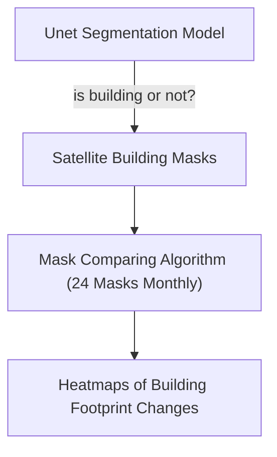
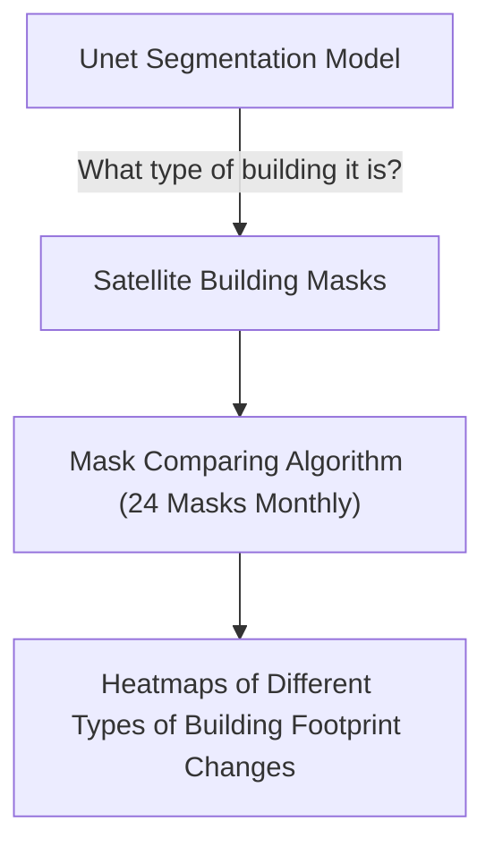

# Preliminary Report

- [Preliminary Report](#preliminary-report)
  - [Abstract](#abstract)
  - [Project Method](#project-method)
    - [Method 0](#method-0)
    - [Method 1](#method-1)
  - [Data sources](#data-sources)

## Abstract

*The SpaceNet labeling team  painstakingly outlined the footprint of each building.*

## Project Method

### Method 0

### Method 1

## Data sources

| Data                      | Source                             | Description                                                                                                                                                                                                                                                                                                                    |
| ------------------------- | ---------------------------------- | ------------------------------------------------------------------------------------------------------------------------------------------------------------------------------------------------------------------------------------------------------------------------------------------------------------------------------ |
| SpaceNet Satellite Images | https://spacenet.ai/sn7-challenge/ | This dataset consists of Planet satellite imagery mosaics, which includes 24 images (one per month) covering ~100 unique geographies. The dataset will comprise over 40,000 square kilometers of imagery and exhaustive polygon labels of building footprints in the imagery, totaling over 10 million individual annotations. |
|                           |                                    |                                                                                                                                                                                                                                                                                                                                |
|                           |                                    |                                                                                                                                                                                                                                                                                                                                |
